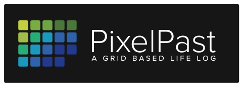

PixelPast is a local-first, open life data platform that transforms fragmented
digital traces into a coherent, explorable timeline of your life.

Inspired by the GitHub contribution grid, PixelPast visualizes years (or decades)
of activity as a multi-scale calendar heatmap and allows drill-down into
rich, cross-linked day-level stories.

> PixelPast — Your life, rendered as pixels.

## ✨ What is PixelPast?

We all generate digital traces:

- Photos and videos
- Calendar events
- Music listening history
- Financial transactions
- Trips and location history
- Work activity
- Sports and health data

But these data streams live in silos.

PixelPast unifies them into a single time-based model and turns them into an
interactive, searchable life chronology.

It is not social media.
It is not cloud-dependent.
It is your data — structured, queryable, visual.

## Core Concept

At its core, PixelPast revolves around a universal `Event` model.

Everything becomes a time-based event:

- A photo
- A meeting
- A song play
- A bank transaction
- A trip
- A work activity

These events are aggregated into daily activity summaries and rendered as:

- Multi-year calendar heatmaps
- Zoomable month views
- Detailed day timelines
- Filtered cross-source views

## 🤝 Contributing

Contributions, ideas and new connectors are welcome.

Before contributing, please review:

- [`VISION.md`](doc/VISION.md)
- [`ARCHITECTURE.md`](doc/ARCHITECTURE.md)
- [`DOMAIN_MODEL.md`](doc/DOMAIN_MODEL.md)
- [`CONVENTIONS.md`](doc/CONVENTIONS.md)

## License

The MIT License (MIT) Copyright (c) 2026 Philip Daubmeier

Permission is hereby granted, free of charge, to any person obtaining a copy of this software and associated documentation files (the "Software"), to deal in the Software without restriction, including without limitation the rights to use, copy, modify, merge, publish, distribute, sublicense, and/or sell copies of the Software, and to permit persons to whom the Software is furnished to do so, subject to the following conditions:

The above copyright notice and this permission notice shall be included in all copies or substantial portions of the Software.

THE SOFTWARE IS PROVIDED "AS IS", WITHOUT WARRANTY OF ANY KIND, EXPRESS OR IMPLIED, INCLUDING BUT NOT LIMITED TO THE WARRANTIES OF MERCHANTABILITY, FITNESS FOR A PARTICULAR PURPOSE AND NONINFRINGEMENT. IN NO EVENT SHALL THE AUTHORS OR COPYRIGHT HOLDERS BE LIABLE FOR ANY CLAIM, DAMAGES OR OTHER LIABILITY, WHETHER IN AN ACTION OF CONTRACT, TORT OR OTHERWISE, ARISING FROM, OUT OF OR IN CONNECTION WITH THE SOFTWARE OR THE USE OR OTHER DEALINGS IN THE SOFTWARE.